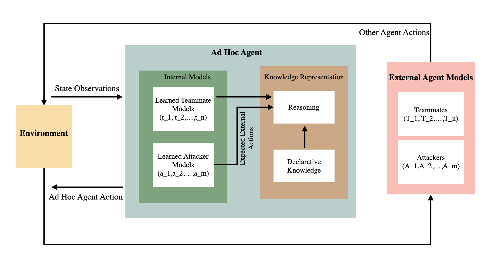
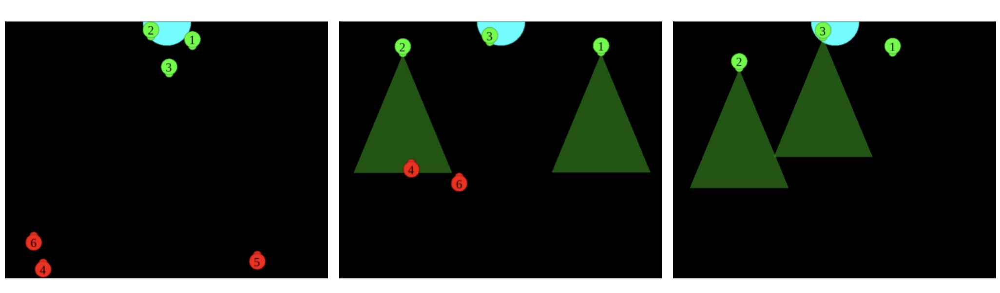
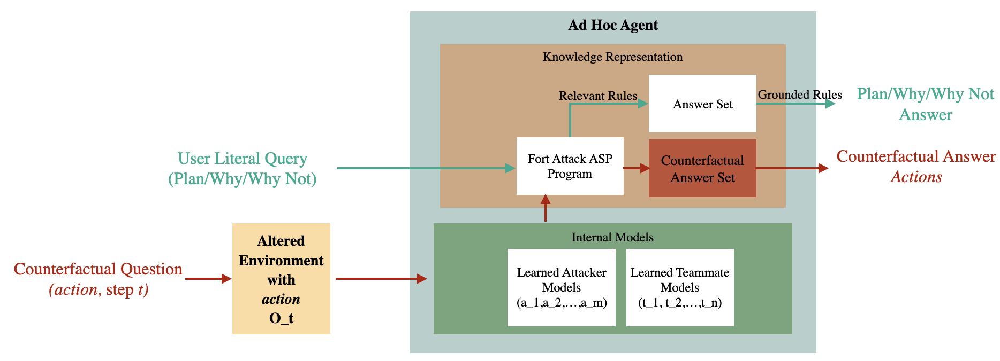
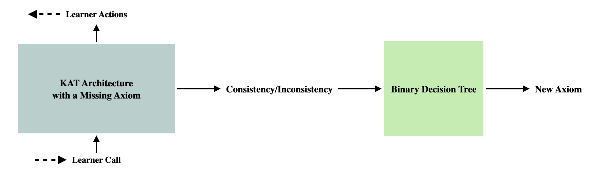
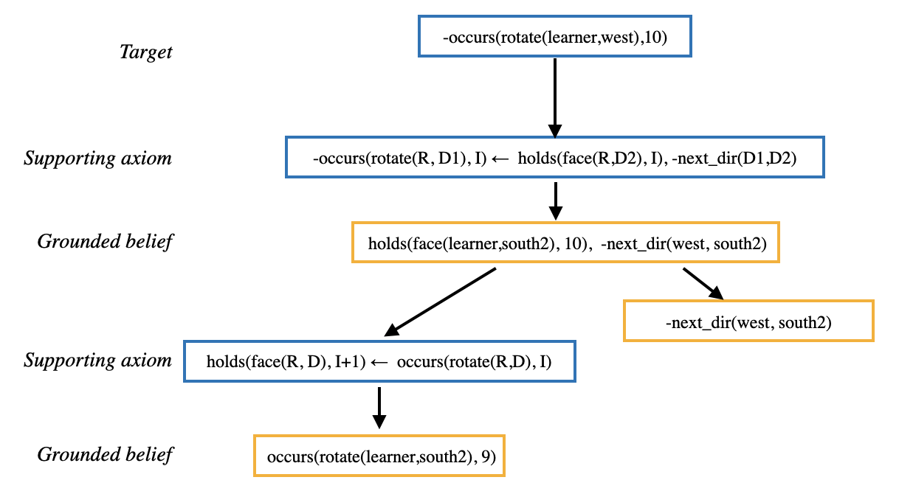
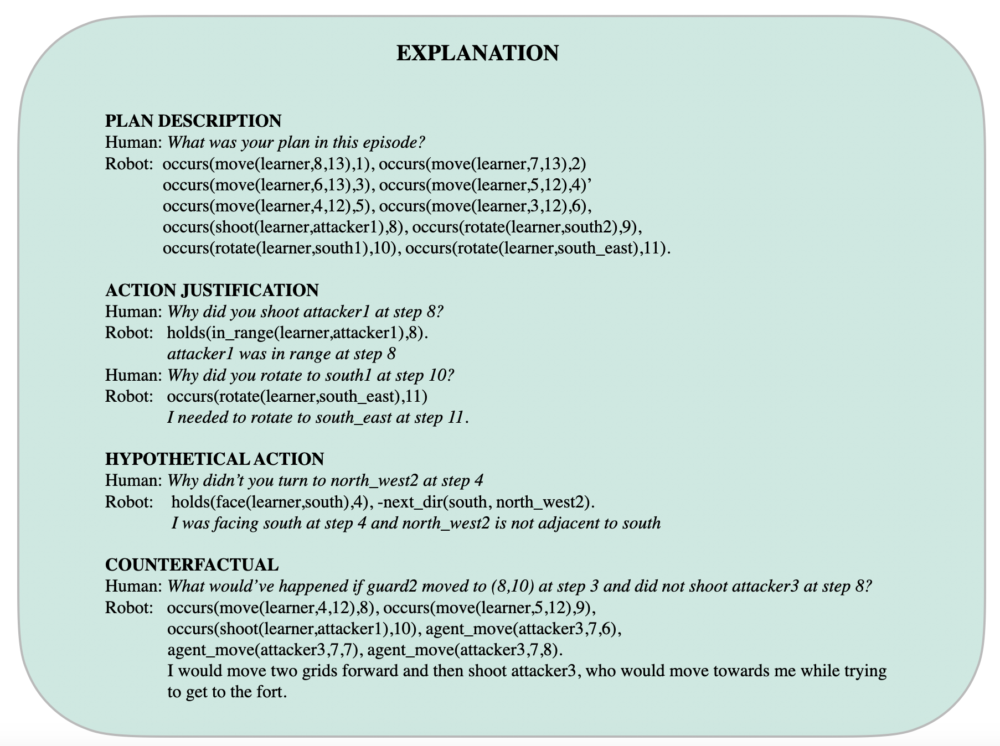

# Explanations and Learning
Repository for MSc project: Explanation and Axiom Learning for Ad Hoc Teamwork. 
For a detailed report of this project, see the thesis linked [here](https://drive.google.com/file/d/1DNTGtDMFa1xbxG65BY_Vduoroh-ChRxH/view).

Knowledge-based ad hoc teamwork (KAT) [(Hasra and Sridharan, 2023)](https://www.cs.bham.ac.uk/~sridharm/Papers/tplp23_ahtPartialObsComm.pdf) is an architecture to tackle the challenges of ad hoc or impromptu robot collaboration, i.e., teamwork with no prior coordination between decentralised and (possibly) heterogeneous robots. The original KAT implementation can be found [here](https://github.com/hharithaki/KAT/tree/main/Code/FA). We implement KAT in a Fort Attack scenario where three attacker attack a fort defended by three defenders. The ego agent is one of the defenders.

This project incorporates explanation and rule learning for the ego agent as shown in the next two figures.

We demonstrated that the learning system could learn a causal law about the environment within 50 episodes. The explanation system could trace causes of beliefs and answer queries about the plan as illustrated below.

## Reference
Dodampegama, H. and Sridharan, M. (2023) Knowledge-based reasoning and learning under partial observability in ad hoc teamwork. Theory and Practice of Logic Programming, pp. 1–19.
